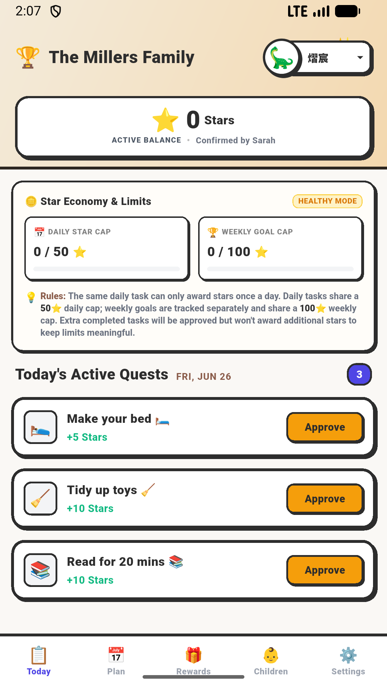
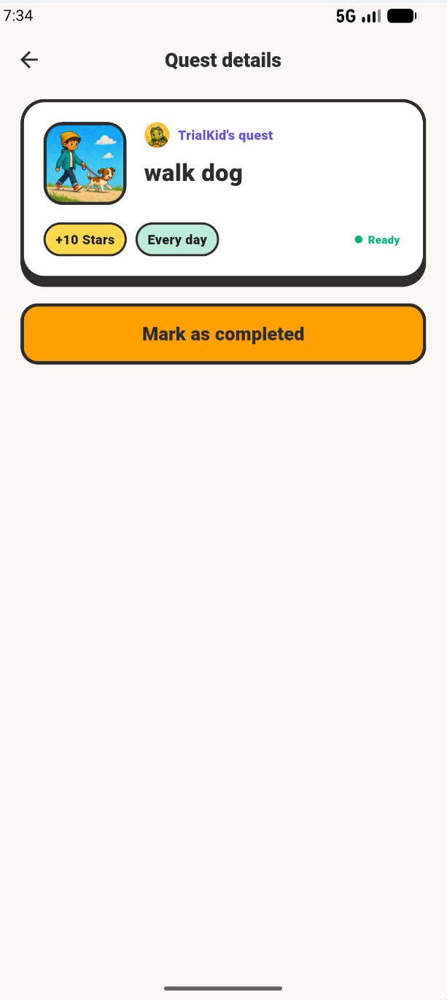
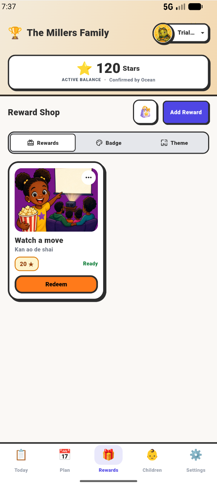
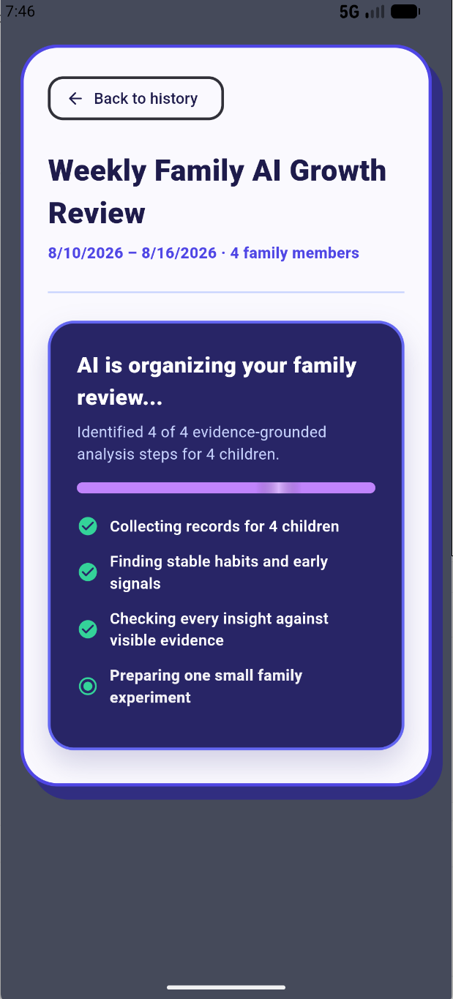

# HabitQuest

**A gamified family habit and allowance hub that turns everyday routines into quests, rewards, and shared progress.**

[Website](https://habitquests.org/) · [中文介绍](README.zh-CN.md) · [Contact](mailto:contact@habitquests.org)

> **Status:** Working MVP · Active Development · Founder-led

## Product snapshot

HabitQuest helps families make routines easier to understand and more motivating. Children see clear quests and progress, while parents retain control over task approval, schedules, and rewards.

| Today's quests | Parent task approval |
| --- | --- |
|  |  |

| Family reward shop | Weekly growth reflection |
| --- | --- |
|  |  |

## What the current MVP supports

- **Quest routines** — create clear, repeatable tasks for everyday family life.
- **Parent controls** — review completion, manage schedules, and keep the experience age-appropriate.
- **Family reward economy** — connect progress with parent-managed virtual and real-world rewards.
- **Growth reflection** — turn recorded activity into evidence-grounded weekly insights.

## Public architecture overview

```text
Flutter client → ASP.NET Core Web API → PostgreSQL
                         ↓
             DigitalOcean cloud services
```

The product is designed as a cross-platform Flutter client backed by an ASP.NET Core API and PostgreSQL. DigitalOcean is the intended cloud platform for application hosting, managed data services, and supporting workloads.

## Current direction

HabitQuest is being developed independently by [Wang Hongyang](https://github.com/whywhy898). Current work focuses on strengthening the core family quest loop, parent controls, reward workflows, and reliable deployment foundations.

## Source availability

The product source code is maintained in a private repository while HabitQuest is under active development. This public repository contains product documentation and selected screenshots only.

## Links

- Product website: [habitquests.org](https://habitquests.org/)
- Privacy and legal information: [habitquest-legal](https://github.com/whywhy898/habitquest-legal)
- Founder: [Wang Hongyang](https://github.com/whywhy898)
- Contact: [contact@habitquests.org](mailto:contact@habitquests.org)

© 2026 HabitQuest. Product documentation and visual assets are provided for informational purposes; see [NOTICE.md](NOTICE.md).
